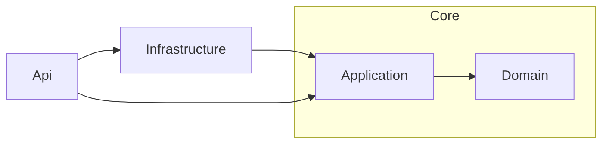

# CSBank

> **Enterprise-inspired banking backend built to learn backend engineering from first principles.**

CSBank is a long-term educational project designed to understand how modern backend systems are built by implementing each layer manually before relying on higher-level abstractions.

The goal is not simply to build a banking application, but to understand **why every abstraction exists** and how it works underneath.

---

# Project Status

**Current Phase**

🚧 Phase 4B — Persistence & Business Operations Engineering

Current feature:

```text
Customer Profile             ✅
Create Account               ✅
Checking Account             ✅
Savings Account              ✅
Deposit                      🚧
Withdraw                     ⏳
Transfer                     ⏳
```

Architecture status:

✅ Stable

---

# Learning Philosophy

CSBank follows one core principle:

> **Understand the abstraction before using the abstraction.**

Every framework introduced in this project should explain a concept that has already been implemented manually.

Learning order:

```text
Programming

↓

Object-Oriented Programming

↓

Software Engineering

↓

Database Engineering

↓

Persistence Engineering

↓

Business Operations Engineering

↓

Entity Framework Core

↓

Performance

↓

Security

↓

Deployment
```

---

# Architecture



Dependency direction:

```text
API
├── Application
└── Infrastructure

Application
└── Domain

Infrastructure
└── Application

Domain
└── nothing
```

---

# Engineering Principles

CSBank follows these design principles throughout the project.

## Clean Architecture

- Domain owns business rules.
- Application orchestrates use cases.
- Infrastructure implements persistence.
- API handles HTTP and dependency injection.

---

## Persistence

Repositories should:

- Execute SQL
- Supply parameters
- Return results

Repositories should not manage:

- Connections
- Transactions
- Commit / Rollback

Infrastructure owns those responsibilities.

---

## Database

Whenever appropriate:

```text
One Business Operation

↓

One Transaction

↓

One SQL Statement

↓

Multiple CTEs

↓

One Database Round Trip
```

The goal is to let PostgreSQL perform relational work efficiently.

---

## Ledger

Current balance is mutable.

Transaction history is immutable.

The ledger is treated as the source of truth.

---

# Technologies

Current stack:

- ASP.NET Core Web API
- PostgreSQL
- Dapper
- Npgsql

Planned:

- Entity Framework Core
- Redis
- Docker
- xUnit
- NSubstitute

---

# What I've Learned

## Software Engineering

- Clean Architecture
- Dependency Injection
- Repository Pattern
- Domain Services
- Manual Mapping
- Composition Root

---

## Database Engineering

- PostgreSQL
- Transactions
- Constraints
- Relationships
- JOINs
- CTEs
- Referential Integrity
- Indexes

---

## Persistence Engineering

- Dapper
- Connection Factory
- Repository Executor
- Higher-Order Functions
- Parameterized SQL
- Transaction Management

---

## Business Operations Engineering

- Business workflow modeling
- Atomic operations
- Row-level locking (`FOR UPDATE`)
- Race condition prevention
- Ledger design
- Audit logging

---

# Current Learning

Currently exploring:

- Atomic business operations
- Deposit implementation
- Transaction safety
- Reusable persistence infrastructure
- Concurrency fundamentals

---

# Documentation

Project documentation is located in `/docs`.

| Document | Purpose |
|----------|---------|
| `Project.md` | Long-term project blueprint |
| `Path.md` | Learning roadmap |
| `TaskNow.md` | Current implementation status |
| `ADR.md` | Architecture Decision Records *(planned)* |

---

# Repository Structure

```text
CSBank

├── docs
│   ├── Project.md
│   ├── Path.md
│   ├── TaskNow.md
│   └── ADR.md
│
├── src
│   ├── csbank.Api
│   ├── csbank.Application
│   ├── csbank.Domain
│   └── csbank.Infrastructure
```

---

# Long-Term Goal

Build a production-quality banking backend while understanding every abstraction beneath the backend stack.

By the completion of CSBank, this project aims to demonstrate practical knowledge of:

- Clean Architecture
- Software Engineering
- Database Engineering
- Persistence Engineering
- Business Operations Engineering
- Entity Framework Core
- Performance
- Networking
- Concurrency
- Security
- Caching
- Testing
- Deployment

Rather than treating frameworks as black boxes, CSBank builds each abstraction from first principles before adopting higher-level tooling.