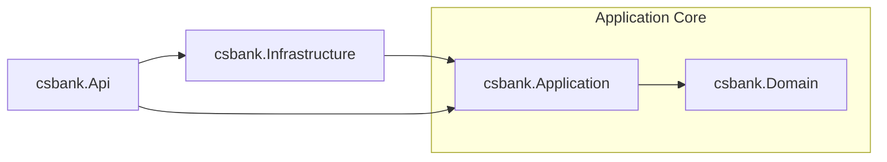

# **My Current Architecture** 

---
- Only the Infrastructure and Domain has the Implementation.
- Domain has no interface, because its service is stateless.
    - Injected it to the application layer service.
    - Example:
    - ```csharp
        private readonly DomainLayerClassService = new();
- Application have Interface (*IRepository*) for the Implementation of the Infrastructure.
- The Api layer Registers the Application and Infrastructure all together via IServiceCollection extension.
