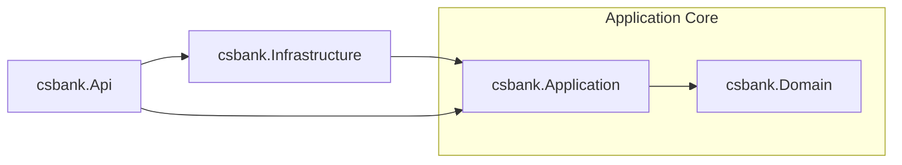

# CSBank

Enterprise-inspired banking backend built to learn backend engineering from first principles.
---
## Goals

- Clean Architecture
- PostgreSQL
- Database Engineering
- Dapper
- Entity Framework Core
- Authentication & Authorization
- Security
- Performance
- Testing
- Deployment

## Current Architecture
CSBank follows a layered Clean Architecture. Business rules remain independent from persistence and presentation concerns.

---
### Design Notes
- Only the Infrastructure and Domain has the Implementation.
- Domain has no interface, because its service is stateless.
    - Injected it to the application layer service.
    - Example:
    - ```csharp
        private readonly DomainLayerClassService = new();
- Application have Interface (*IRepository*) for the Implementation of the Infrastructure.
- The Api layer Registers the Application and Infrastructure all together via IServiceCollection extension.

## Learning Progress

### Architecture
- [x] Clean Architecture
- [x] Dependency Injection
- [x] Manual Mapping

### Database Engineering
- [x] SQL Fundamentals
- [x] Relational Modeling
- [x] Transactions
- [x] Multi-table CRUD
- [ ] Database Migrations

### Persistence
- [ ] Dapper
- [ ] Entity Framework Core

### Backend
- [ ] Authentication
- [ ] Authorization
- [ ] Validation
- [ ] Caching
- [ ] Background Services

### Quality
- [ ] Unit Testing
- [ ] Integration Testing
- [ ] Performance Benchmarking