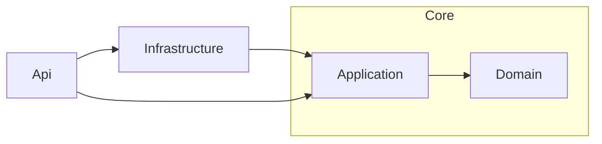

# CSBank

> **Enterprise-inspired banking backend built to learn backend engineering from first principles.**

CSBank is a long-term educational project designed to understand how modern backend systems are built by implementing each layer manually before relying on higher-level abstractions.

The goal is not simply to build a banking application, but to understand **why every abstraction exists** and how it works underneath.

---

# Project Status

**Current Phase**

🚧 **Phase 8 — Security Engineering**

Current feature status:

```text
Customer Registration                 ✅
Customer Profile                      ✅
Create Account (Checking/Savings)     ✅
Deposit                               ✅
Transfer                              ✅
Transaction History                   ✅
Audit Logging                         ✅

Relational DB Design (3NF)            ✅
Dapper / PostgreSQL Persistence        ✅
Entity Framework Core                  ✅

JWT Authentication                    ✅
Login                                 ✅
Refresh Tokens                         ✅
Refresh Token Hashing                  ✅
Refresh Token Expiration               ✅
Refresh Token Rotation                 ✅
Logout / Refresh Token Revocation      ✅

Authorization                          🚧
API Security                           🚧
Security Hardening                     🚧
Security Testing                       🚧
```

Architecture status:

✅ Stable

Current persistence preference:

```text
Writes → EF Core where appropriate
Reads  → Dapper / Handwritten SQL

Preferred approach for CSBank:
Dapper + PostgreSQL
```

EF Core has been learned and integrated successfully, but it is not currently the primary persistence abstraction for the project. Dapper and handwritten PostgreSQL remain preferred where they provide the level of SQL control desired by the project.

---

# Learning Philosophy

CSBank follows one core principle:

> **Understand the abstraction before using the abstraction.**

Every framework introduced in this project should explain a concept that has already been implemented manually.

The preferred learning process is:

```text
Problem
   ↓
Concept
   ↓
Pattern
   ↓
Manual Understanding
   ↓
Abstraction
   ↓
Implementation
   ↓
Verification
```

AI is primarily used as a conceptual reviewer rather than a code generator.

The goal is to develop the ability to independently reason about:

```text
Application Behavior
        ↓
Persistence
        ↓
Database State
        ↓
Transactions
        ↓
Concurrency
        ↓
Security
```

---

# Architecture


```mermaid
flowchart LR

subgraph Core

Application --> Domain

end

Infrastructure --> Application

Api --> Application

Api --> Infrastructure
```

Dependency direction:

```text
API
├── Application
└── Infrastructure

Application
└── Domain

Infrastructure
└── Application

Domain
└── nothing
```

---

# Engineering Principles

CSBank follows these design principles throughout the project.

## Clean Architecture

* Domain owns business rules.
* Application orchestrates use cases.
* Infrastructure implements persistence.
* API handles HTTP and dependency injection.
* The Domain remains persistence-agnostic.

---

## Persistence

Repositories should:

* Execute SQL / queries through the appropriate persistence abstraction
* Supply parameters
* Return results

Infrastructure owns:

* Connection lifecycle
* Transactions
* Commit / rollback
* Database-specific implementation details

CSBank intentionally uses a hybrid persistence strategy:

```text
                    Persistence
                         │
             ┌───────────┴───────────┐
             ↓                       ↓
          Dapper                  EF Core
             │                       │
      Handwritten SQL          Change Tracking
      Precise Reads             Unit of Work
             │                       │
             └───────────┬───────────┘
                         ↓
                     PostgreSQL
```

Dapper is preferred when explicit SQL control, PostgreSQL features, and predictable query behavior are important.

EF Core is used as a learned persistence abstraction and remains available when its change tracking and unit-of-work capabilities provide value.

---

## Database

Whenever appropriate:

```text
One Business Operation

↓

One Transaction

↓

One SQL Statement

↓

Multiple CTEs

↓

One Database Round Trip
```

The goal is to let PostgreSQL perform relational work efficiently while keeping transaction boundaries explicit.

---

## Ledger

Current balance is mutable.

Transaction history is immutable.

Financial operations are modeled around transactional consistency and an auditable transaction history.

---

## Concurrency

CSBank explicitly considers concurrency during financial operations.

Where appropriate:

```text
Transaction
    ↓
Row Lock
    ↓
Business Validation
    ↓
State Change
    ↓
Transaction History
    ↓
Audit
```

PostgreSQL mechanisms such as:

* `FOR UPDATE`
* Transactions
* Constraints
* Atomic SQL statements
* Writable CTEs

are used to maintain consistency.

---

# Technologies

Current stack:

* C#
* ASP.NET Core Web API
* PostgreSQL
* Dapper
* Entity Framework Core
* Npgsql
* JWT Authentication

Planned / future:

* CancellationToken / request cancellation
* Authorization policies
* Rate limiting
* CORS configuration
* Security hardening
* Security testing
* xUnit
* NSubstitute
* Redis
* Docker
* Payment gateway sandbox integration
* Angular client

---

# What I've Learned

## Software Engineering

* Clean Architecture
* Dependency Injection
* Repository Pattern
* Domain Services
* Manual Mapping
* Application Services
* Composition Root
* Separation of concerns

---

## Database Engineering

* PostgreSQL
* Transactions
* Constraints
* Relationships
* JOINs
* CTEs
* Writable CTEs
* `RETURNING`
* `FOR UPDATE`
* Referential Integrity
* Indexes
* `EXPLAIN`
* `EXPLAIN ANALYZE`
* Query plan interpretation

---

## Persistence Engineering

* Dapper
* Npgsql
* Connection Factory
* Repository Executor
* Higher-Order Functions
* Parameterized SQL
* Transaction Management
* EF Core
* `DbContext`
* `DbSet`
* Fluent API
* Entity Configurations
* Navigation Properties
* Change Tracking
* Entity States
* `SaveChanges`
* Tracking vs. `AsNoTracking`
* Generated SQL inspection
* EF Core vs. Dapper trade-offs

---

## Business Operations Engineering

* Business workflow modeling
* Atomic operations
* Row-level locking
* Race condition prevention
* Ledger design
* Transaction history
* Audit logging
* Financial state transitions

Implemented financial operations include:

```text
Deposit
Transfer
Account Creation
Transaction History
```

---

## Security Engineering

### Authentication

* JWT access tokens
* Authentication middleware
* Login
* Password verification
* Refresh tokens
* Refresh-token hashing
* Refresh-token expiration
* Refresh-token rotation
* Refresh-token revocation
* Logout
* Claims
* Roles

Current authentication lifecycle:

```text
Login
  ↓
Access Token + Refresh Token
  ↓
Authenticated API Requests
  ↓
Access Token Expiration
  ↓
Refresh Token
  ↓
New Access Token
```

Logout:

```text
Logout
  ↓
Refresh Token Revoked
  ↓
Existing Access Token
  ↓
Remains valid until JWT expiration
```

The current access-token lifetime is intentionally short-lived, while refresh tokens provide session continuity.

### Authorization

Currently being expanded toward:

* `[Authorize]`
* Roles
* Claims
* Policies
* Resource ownership
* Endpoint protection

---

# Current Learning

Currently exploring:

## Phase 8 — Security Engineering

The current focus is expanding CSBank from an authenticated backend into a properly authorized and security-hardened backend.

Current topics:

* Authentication lifecycle verification
* CancellationToken
* Request cancellation
* Authorization
* Roles
* Claims
* Policies
* Resource ownership
* CORS
* Rate limiting
* Request validation
* Security headers
* Secrets management
* Database least privilege
* Security testing

---

# Payment Integration

Payment integration is planned as a future extension of CSBank.

The initial objective is **payment-gateway sandbox integration**, not handling real customer funds.

The learning focus will be:

```text
Payment Creation
      ↓
Payment Provider
      ↓
Payment Status
      ↓
Webhook
      ↓
Webhook Verification
      ↓
Idempotency
      ↓
Payment State Machine
      ↓
Database Transaction
      ↓
Transaction History
      ↓
Audit
```

The purpose is to learn distributed payment workflows, asynchronous events, idempotency, retries, and failure handling without prematurely introducing real-money operational requirements.

---

# Documentation

Project documentation is located in `/docs`.

| Document     | Purpose                       |
| ------------ | ----------------------------- |
| `Project.md` | Long-term project blueprint   |
| `Path.md`    | Learning roadmap              |
| `TaskNow.md` | Current implementation status |

---

# Repository Structure

```text
CSBank

├── docs
│   ├── Project.md
│   ├── Path.md
│   ├── TaskNow.md
│   └── ADR.md
│
├── src
│   ├── csbank.Api
│   ├── csbank.Application
│   ├── csbank.Domain
│   └── csbank.Infrastructure
```

---

# Long-Term Goal

Build a production-quality banking backend while understanding every abstraction beneath the backend stack.

By the completion of CSBank, this project aims to demonstrate practical knowledge of:

* Clean Architecture
* Software Engineering
* Database Engineering
* Persistence Engineering
* Business Operations Engineering
* Entity Framework Core
* Performance Engineering
* Networking
* Concurrency
* Security
* Distributed Systems
* Caching
* Testing
* Payment Integration
* Deployment

Rather than treating frameworks as black boxes, CSBank builds an understanding of the underlying concepts before adopting higher-level tooling.

The ultimate goal is not simply:

> **Build a banking API.**

It is:

> **Become capable of designing and implementing backend systems while understanding what the abstractions are actually doing.**
