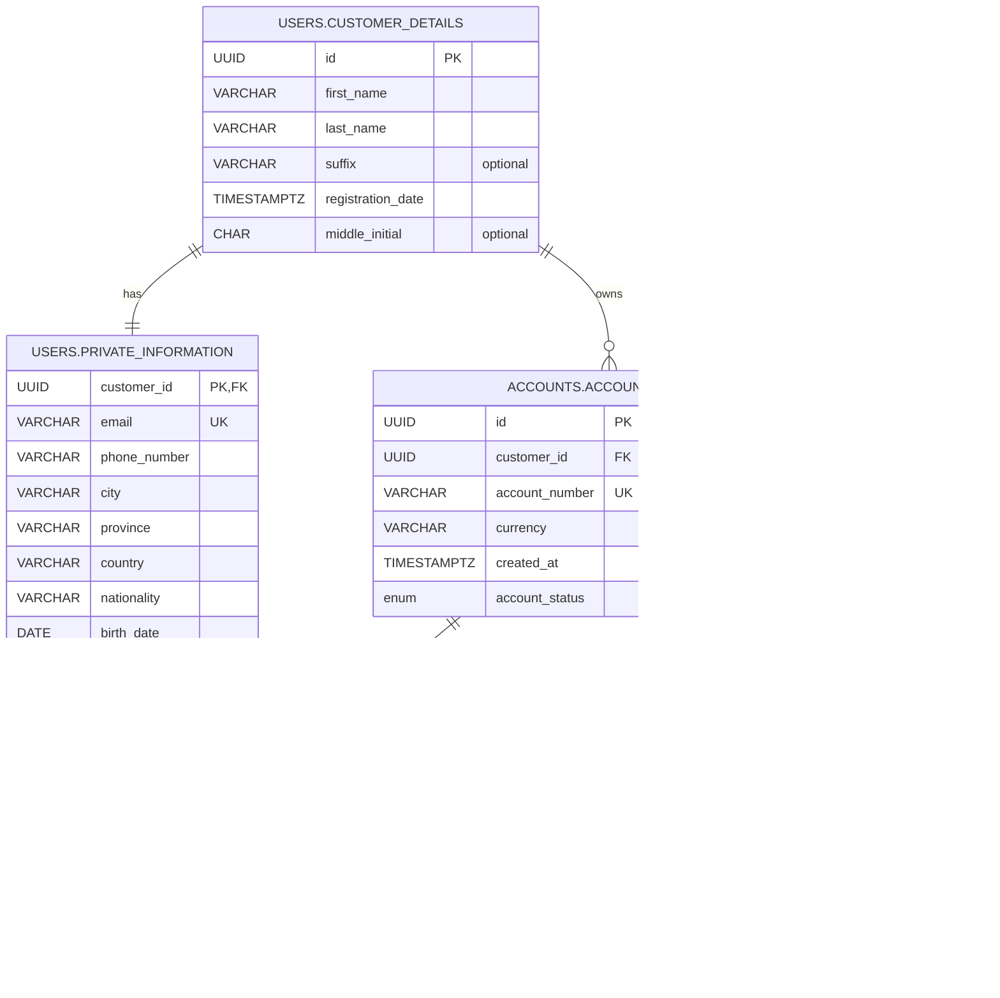

# CSBANK Relational Model

## Legend

- PK = Primary Key
- FK = Foreign Key
- UK = Unique Key
- TIMESTAMPTZ = Timestamp with Time Zone

```mermaid
erDiagram
    USERS.CUSTOMER_DETAILS ||--|| USERS.PRIVATE_INFORMATION : has
    USERS.CUSTOMER_DETAILS ||--o{ ACCOUNTS.ACCOUNT_DETAILS : owns
    ACCOUNTS.ACCOUNT_DETAILS ||--o| ACCOUNTS.CHECKING_ACCOUNT : extends
    ACCOUNTS.ACCOUNT_DETAILS ||--o| ACCOUNTS.SAVINGS_ACCOUNT : extends
    
    USERS.CUSTOMER_DETAILS {
        UUID id PK
        VARCHAR first_name
        VARCHAR last_name
        VARCHAR suffix "optional"
        TIMESTAMPTZ registration_date
        CHAR middle_initial "optional"
    }
    
    USERS.PRIVATE_INFORMATION {
        UUID customer_id PK,FK
        VARCHAR email UK
        VARCHAR phone_number
        VARCHAR city
        VARCHAR province
        VARCHAR country
        VARCHAR nationality
        DATE birth_date
    }

    ACCOUNTS.ACCOUNT_DETAILS{
        UUID id PK
        UUID customer_id FK
        VARCHAR account_number UK
        VARCHAR currency
        TIMESTAMPTZ created_at
        enum account_status "enum: (Active, Frozen, Closed)"
    }

    ACCOUNTS.CHECKING_ACCOUNT{
        UUID account_id PK,FK
        NUMERIC balance
        NUMERIC overdraft_limit
        enum modes_of_payment "enum: (Debit, Online, Check)"
        NUMERIC interest_rate
        NUMERIC fees
    }

    ACCOUNTS.SAVINGS_ACCOUNT{
        UUID account_id PK,FK
        NUMERIC balance
        NUMERIC withdrawal_usage
        NUMERIC interest_rate
        NUMERIC fees
    }

```