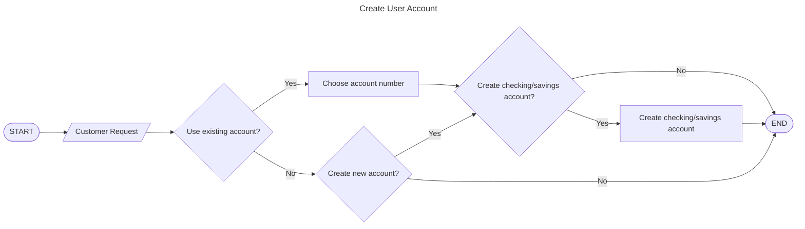
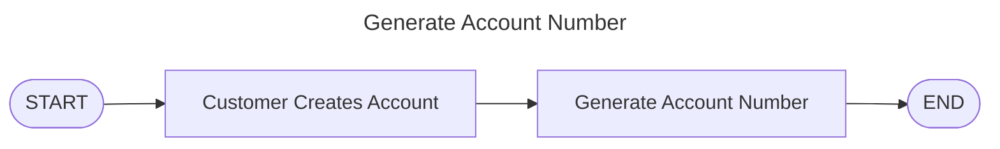

```mermaid
---
title: Create User Account
---
flowchart LR
    A([START]) --> B[/Customer Request/]
    B --> C{Use existing account?}
    C -- Yes --> D[Choose account number]
    D --> E{Create checking/savings account?}
    E -- Yes --> F[Create checking/savings account]
    E -- No --> G([END])
    F --> G
    C -- No --> H{Create new account?}
    H -- Yes --> E
    H -- No --> G
```

```mermaid
---
title: Generate Account Number
---
flowchart LR
    A([START]) --> B[Customer Creates Account]
    B --> C[Generate Account Number]
    C --> D([END])
```