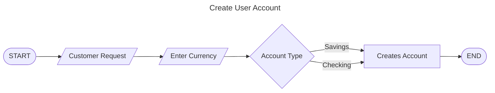
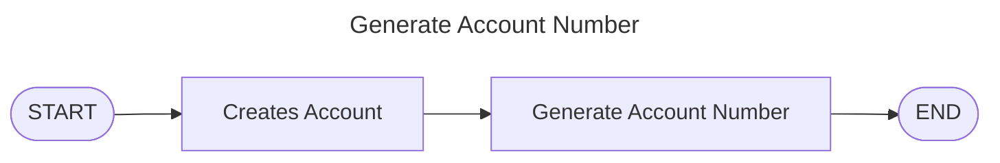

```mermaid
---
title: Create User Account
---
flowchart LR
    A([START]) --> B[/Customer Request/]
    B -->  C[/Enter Currency/]
    C --> D{Account Type}
    D --Savings--> E[Creates Account]
    D --Checking--> E
    E --> G([END])
```

```mermaid
---
title: Generate Account Number
---
flowchart LR
    A([START]) --> B[Creates Account]
    B --> C[Generate Account Number]
    C --> D([END])
```