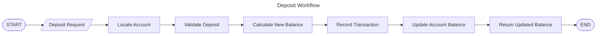

```mermaid
---
title: Deposit Workflow
---
flowchart LR
    A([START]) --> B[/Deposit Request/]
    B --> C[Locate Account]
    C --> D[Validate Deposit]
    D --> E[Calculate New Balance]
    E --> F[Record Transaction]
    F --> G[Update Account Balance]
    G --> H[Return Updated Balance]
    H --> I([END])
```