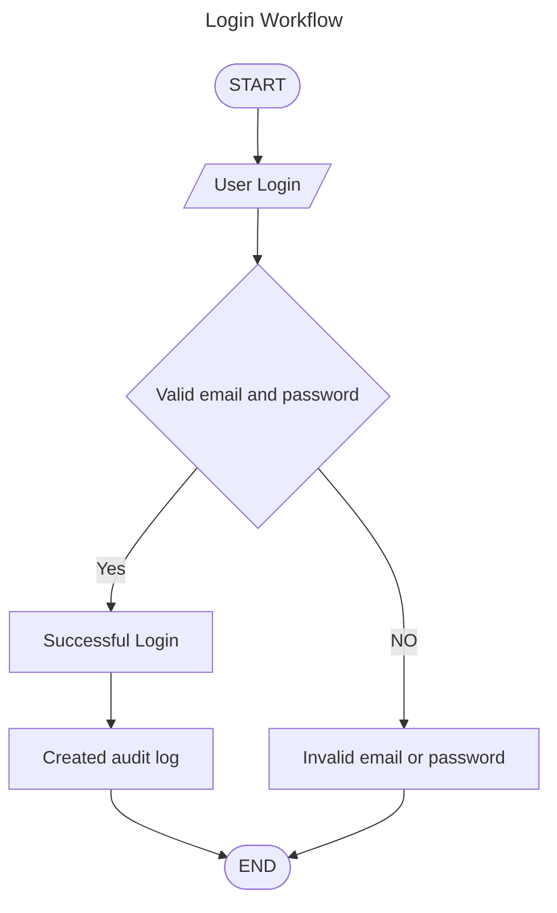

```mermaid
---
title: Login Workflow
---
flowchart TD
    A([START]) --> B[/User Login/]
    B --> C{Valid email and password}
    C --Yes--> D[Successful Login]
    D --> E[Created audit log]
    C --NO--> F[Invalid email or password]
    E --> G([END])
    F --> G
```