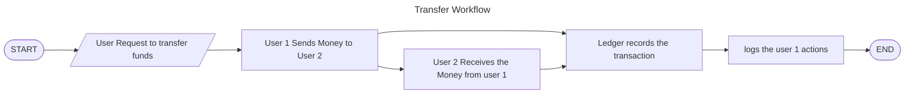

```mermaid
---
title: Transfer Workflow
---
flowchart LR

    A([START]) --> B[/User Request to transfer funds/]
    B --> C[User 1 Sends Money to User 2]
    C --> D[User 2 Receives the Money from user 1]
    C --> E[Ledger records the transaction]
    D --> E
    E --> F[logs the user 1 actions]
    F --> G([END])

```