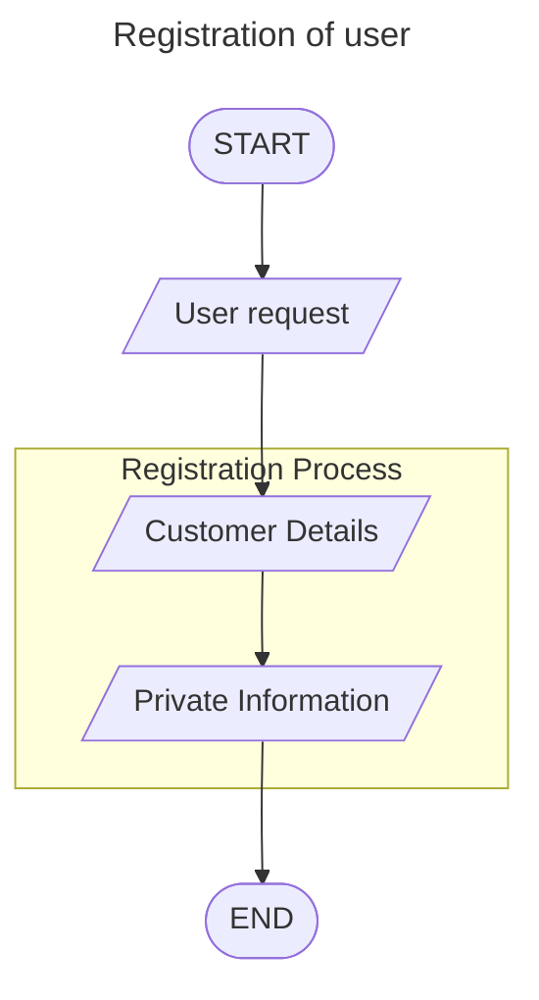

```mermaid
---
title: Registration of user
---
flowchart TD
    A([START]) --> B[/User request/]

   subgraph SubID [Registration Process]
        C[/Customer Details/]
        D[/Private Information/]
    end

    B --> C
    C --> D

    D --> E([END])

```