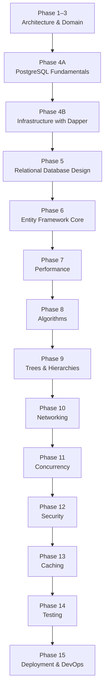

# Path.md

# CSBank Learning Path

This roadmap is designed to build **CSBank** while learning backend engineering from the ground up.

Every phase introduces concepts only after the previous foundation has been understood, ensuring that each abstraction is learned through implementation rather than memorization.

The objective is not simply to build a banking system, but to understand **why each technology exists** before using higher-level abstractions.

---

# Current Progress

| Phase                                   | Status     |
| --------------------------------------- | ---------- |
| Phase 1–3 — Clean Architecture & Domain | ✅ Complete |
| Phase 4A — PostgreSQL Fundamentals      | ✅ Complete |
| Phase 4B — Infrastructure with Dapper   | 🚧 Current |
| Phase 5 — Relational Database Design    | ⏳ Planned  |
| Phase 6 — Entity Framework Core         | ⏳ Planned  |

Current milestone:

You have completed the SQL foundation required for backend development.

The Multi-Table CRUD Capstone marked the transition from learning individual SQL statements to designing complete business operations.

CSBank now moves into implementing **real persistence** using Dapper while preserving the existing Clean Architecture.

---

# Learning Philosophy

The learning order is intentional.

```text
Programming

↓

Object-Oriented Programming

↓

Software Engineering

↓

SQL & PostgreSQL

↓

Dapper

↓

Relational Database Design

↓

Entity Framework Core
```

Every framework should explain an abstraction you already understand rather than introducing hidden behavior.

---

# Learning Roadmap



---

# Phase 1–3 — Clean Architecture ✅

Completed.

Concepts learned:

* Clean Architecture
* Solution organization
* Domain models
* Domain services
* Business rules
* DTOs
* Manual mapping
* Repository abstraction
* Dependency Injection
* Customer Registration use case

Current architecture:

```text
HTTP Request

↓

API

↓

Application

↓

Domain Service

↓

Repository Interface

↓

(Mock Repository)
```

Outcome:

A complete architecture with mock persistence, ready for a real database implementation.

---

# Phase 4A — PostgreSQL Fundamentals ✅

Completed.

The objective of this phase was not simply learning SQL syntax.

It was learning how backend engineers design, query, evolve, and protect relational databases.

Completed:

### Database Fundamentals

* CREATE DATABASE
* Schemas
* CREATE TABLE
* PostgreSQL data types

### CRUD

* INSERT
* Multi-row INSERT
* RETURNING
* Writable CTEs (`WITH`)
* SELECT
* WHERE
* ORDER BY
* UPDATE
* DELETE

### Relationships

* Primary Keys
* Foreign Keys
* One-to-One
* One-to-Many

### JOINs

* INNER JOIN
* LEFT JOIN
* RIGHT JOIN
* FULL JOIN (Conceptual)

### Transactions

* BEGIN
* COMMIT
* ROLLBACK
* Statement-level atomicity
* Transaction-level atomicity

### Constraints

* UNIQUE
* CHECK
* Referential Integrity
* CASCADE behaviors

### Indexes

* CREATE INDEX
* CREATE UNIQUE INDEX

### Query Design

* Explicit column selection
* Business-oriented queries
* Aggregation basics
* GROUP BY
* COUNT

### ORM Mental Model

Understand that:

* PostgreSQL stores relational data—not objects.
* JOINs reconstruct object graphs.
* Dapper executes SQL directly.
* EF Core abstracts SQL and persistence.

### Multi-Table CRUD Capstone

Completed.

Implemented:

* Customer Registration
* Customer Retrieval
* Customer Update
* Customer Deletion
* Multi-table JOINs
* Transactions
* Constraints
* Referential Integrity

Major outcome:

Transitioned from thinking in isolated SQL statements to complete business operations.

---

# Phase 4B — Infrastructure with Dapper 🚧

Current Phase.

Implement:

* PostgreSQL connectivity
* Npgsql
* Dapper
* Repository implementations
* SQL execution
* Parameterized queries
* Dependency Injection
* Customer Registration persistence

Application flow becomes:

```text
HTTP Request

↓

API

↓

Application

↓

Domain Service

↓

Repository Interface

↓

Infrastructure Repository

↓

Dapper

↓

PostgreSQL
```

Learn:

* Connection factories
* SQL file organization
* Executing SQL from C#
* Mapping query results
* Infrastructure responsibilities

Goal:

Replace mock repositories with real persistence while understanding every SQL statement being executed.

---

# Phase 5 — Relational Database Design

Expand and refine the existing CSBank database.

Topics:

* One-to-One
* One-to-Many
* Many-to-Many
* Composite Keys
* Candidate Keys
* Alternate Keys
* Normalization (1NF–3NF)
* Denormalization trade-offs
* Index strategy
* Constraint design
* Schema evolution
* ERD refinement

Purpose:

Understand how enterprise databases are modeled before learning EF Core's mapping abstractions.

The existing CSBank schema will evolve rather than be rebuilt.

---

# Phase 6 — Entity Framework Core

Only after SQL, Dapper, and relational database design.

Learn:

* DbContext
* DbSet
* LINQ
* Fluent API
* Entity Configuration
* Migrations
* Change Tracking
* Relationship Mapping
* Value Conversions
* Loading strategies

Objective:

Understand EF Core as a productivity layer built on top of SQL, relational modeling, and persistence concepts already learned.

The goal is to recognize what EF Core generates rather than treating it as a black box.

---

# Phase 7 — Performance

Database:

* Query plans
* EXPLAIN ANALYZE
* Query optimization
* Index strategy

Application:

* Big-O analysis
* Collection performance
* Memory usage

Practice:

Benchmark indexed versus non-indexed lookups using seeded CSBank data.

---

# Phase 8 — Algorithms

Implement algorithms inside the Application layer.

Topics:

* Binary Search
* QuickSort
* MergeSort
* Hash-based lookups
* Sorting strategies

Purpose:

Efficiently process data after retrieval from the database.

---

# Phase 9 — Trees & Hierarchies

Model banking structures.

Topics:

* Recursive traversal
* Tree structures
* Parent-child hierarchies
* Aggregation
* Recursive SQL concepts

---

# Phase 10 — Networking

Expand the REST API.

Topics:

* HTTP
* REST
* Status Codes
* HTTPS
* CORS
* Idempotency
* API design

---

# Phase 11 — Concurrency

Handle simultaneous requests safely.

Topics:

* Transaction isolation
* Optimistic concurrency
* Concurrent updates
* Duplicate registration handling
* Unique constraint conflicts
* Race conditions

---

# Phase 12 — Security

Implement:

* Password hashing abstraction
* BCrypt
* JWT Authentication
* Authorization
* Secure DTO projection
* Input validation
* SQL Injection prevention

---

# Phase 13 — Caching

Learn:

* IMemoryCache
* Distributed Cache
* Redis
* Cache invalidation
* Cache-aside pattern

---

# Phase 14 — Testing

Testing stack:

* xUnit
* NSubstitute

Test:

* Domain services
* Application services
* Repository implementations
* API endpoints
* Integration tests

---

# Phase 15 — Deployment & DevOps

Learn:

* Docker
* Docker Compose
* CI/CD
* Environment configuration
* Cloud deployment
* Logging
* Monitoring
* Configuration management

---

# End Goal

Build a production-quality banking backend while understanding every abstraction throughout the stack.

By the end of CSBank, you should understand:

* Clean Architecture
* PostgreSQL
* SQL
* Database Engineering
* Dapper
* Relational Database Design
* Entity Framework Core
* Performance
* Algorithms
* Networking
* Concurrency
* Security
* Caching
* Testing
* Deployment

Every phase intentionally builds upon the previous one so that each new technology reinforces concepts already learned instead of replacing them.

The objective is not simply to finish CSBank, but to understand the engineering principles that each layer of the backend stack abstracts.
