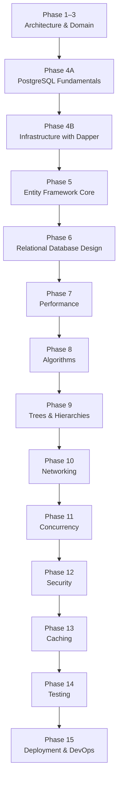

# Path.md

# CSBank Learning Path

This roadmap is designed to build **CSBank** while learning backend engineering from the ground up.

Every phase introduces concepts only after the previous foundation has been understood, ensuring that each abstraction is learned through implementation rather than memorization.

The objective is not simply to build a banking system, but to understand **why each technology exists** before using higher-level abstractions.

---

# Current Progress

| Phase | Status |
|--------|--------|
| Phase 1–3 — Clean Architecture & Domain | ✅ Complete |
| Phase 4A — PostgreSQL Fundamentals | 🟨 Capstone Remaining |
| Phase 4B — Dapper Infrastructure | 🚀 Next |
| Phase 5 — Entity Framework Core | ⏳ Planned |

Current milestone:

You have finished learning the SQL concepts required for backend development.

The final step of Phase 4A is integrating those concepts through the **Multi-Table CRUD Capstone**, after which CSBank development resumes with Dapper.

---

# Learning Philosophy

The learning order is intentional.

```text
Programming

↓

Object-Oriented Programming

↓

Software Engineering

↓

SQL

↓

Dapper

↓

Entity Framework Core
```

Every framework should explain an abstraction you already understand rather than introducing hidden behavior.

---

# Learning Roadmap



---

# Phase 1–3 — Clean Architecture ✅

Completed.

Concepts learned:

- Clean Architecture
- Solution organization
- Domain models
- Domain services
- Business rules
- DTOs
- Manual mapping
- Repository abstraction
- Dependency Injection
- Customer Registration use case

Current architecture:

```text
HTTP Request

↓

API

↓

Application

↓

Domain Service

↓

Repository Interface

↓

(Mock Repository)
```

Outcome:

A complete architecture with mock persistence, ready for a real database implementation.

---

# Phase 4A — PostgreSQL Fundamentals 🟨

Status:

SQL concepts complete.

Capstone remaining.

Completed:

### Database Fundamentals

- CREATE DATABASE
- Schemas
- Tables
- PostgreSQL data types

### CRUD

- INSERT
- Multi-row INSERT
- RETURNING
- Common Table Expressions (`WITH`)
- SELECT
- WHERE
- ORDER BY
- UPDATE
- DELETE

### Relationships

- Primary Keys
- Foreign Keys
- One-to-One
- One-to-Many

### JOINs

- INNER JOIN
- LEFT JOIN
- RIGHT JOIN
- FULL JOIN (Conceptual)

### Transactions

- BEGIN
- COMMIT
- ROLLBACK
- Statement-level atomicity
- Transaction-level atomicity

### Constraints

- UNIQUE
- CHECK

### Indexes

- CREATE INDEX
- CREATE UNIQUE INDEX

### ORM Mental Model

Understand that:

- Objects do not exist inside PostgreSQL.
- Relational data is reconstructed into object graphs.
- Dapper executes SQL directly.
- EF Core abstracts SQL through higher-level APIs.

Remaining:

## Multi-Table CRUD Capstone

Implement realistic CSBank workflows using:

- Customer
- PrivateInformation
- Account
- SavingsAccount
- Loan

Practice:

- INSERT
- SELECT
- UPDATE
- DELETE
- JOINs
- Transactions
- Constraints
- Referential integrity

Goal:

Stop learning SQL as isolated statements and begin thinking in complete business operations.

Completing this capstone finishes Phase 4A.

---

# Phase 4B — Infrastructure with Dapper 🚀

Immediately after the capstone.

Implement:

- PostgreSQL connection
- Dapper
- Repository implementations
- SQL execution
- Dependency Injection
- Customer Registration persistence

Application flow becomes:

```text
HTTP Request

↓

API

↓

Application

↓

Domain Service

↓

IRepository

↓

Infrastructure Repository

↓

Dapper

↓

PostgreSQL
```

Goal:

Replace mock repositories with real persistence while understanding every SQL statement being executed.

---

# Phase 5 — Entity Framework Core

Only after SQL and Dapper.

Learn:

- DbContext
- DbSet
- LINQ
- Fluent API
- Migrations
- Change Tracking
- Relationship Mapping

Objective:

Understand EF Core as a productivity layer built on top of SQL concepts already mastered.

---

# Phase 6 — Relational Database Design

Improve the existing CSBank schema.

Topics:

- Primary Keys
- Foreign Keys
- One-to-One
- One-to-Many
- Many-to-Many
- Normalization (1NF–3NF)

Purpose:

Refine database design rather than learning SQL syntax.

---

# Phase 7 — Performance

Database:

- Query plans
- Query optimization
- Index strategy

Application:

- Big-O analysis
- Collection performance
- Memory usage

Practice:

Benchmark indexed versus non-indexed lookups using seeded CSBank data.

---

# Phase 8 — Algorithms

Implement algorithms inside the Application layer.

Topics:

- Binary Search
- QuickSort
- MergeSort

Purpose:

Efficiently process data after retrieval from the database.

---

# Phase 9 — Trees & Hierarchies

Model banking structures.

Topics:

- Recursive traversal
- Tree structures
- Parent-child hierarchies
- Aggregation

---

# Phase 10 — Networking

Expand the REST API.

Topics:

- HTTP
- REST
- Status Codes
- HTTPS
- CORS
- Idempotency

---

# Phase 11 — Concurrency

Handle simultaneous requests safely.

Topics:

- Transaction isolation
- Optimistic concurrency
- Duplicate registration handling
- Concurrent updates
- Unique constraint conflicts

---

# Phase 12 — Security

Implement:

- Password hashing abstraction
- BCrypt
- JWT Authentication
- Authorization
- Secure DTO projection

---

# Phase 13 — Caching

Learn:

- IMemoryCache
- Distributed Cache
- Redis
- Cache invalidation

---

# Phase 14 — Testing

Testing stack:

- xUnit
- NSubstitute

Test:

- Domain services
- Application use cases
- Repository implementations
- API endpoints

---

# Phase 15 — Deployment & DevOps

Learn:

- Docker
- CI/CD
- Environment configuration
- Cloud deployment
- Logging
- Monitoring

---

# End Goal

Build a production-quality banking backend while understanding every abstraction throughout the stack.

By the end of CSBank, you should understand:

- Clean Architecture
- SQL
- PostgreSQL
- Dapper
- Entity Framework Core
- Relational Database Design
- Performance
- Algorithms
- Networking
- Concurrency
- Security
- Caching
- Testing
- Deployment

Every phase intentionally builds upon the previous one so that each new technology reinforces concepts already learned instead of replacing them.