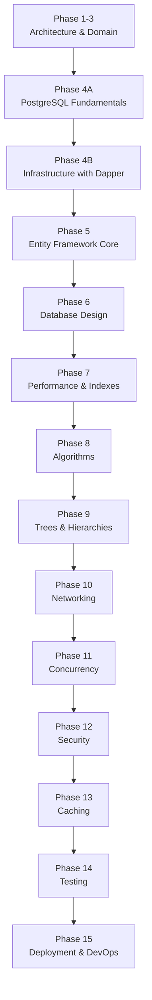

# Path.md

# CSBank Learning Path

This roadmap is designed to build **CSBank** while learning backend engineering from the ground up. Every phase introduces concepts only after the previous foundation has been understood.

The objective is not simply to build a banking system, but to understand **why each technology exists** before using higher-level abstractions.

---

# Current Progress

| Phase | Status |
|--------|--------|
| Phase 1–3 — Clean Architecture & Domain | ✅ Complete |
| Phase 4A — PostgreSQL Fundamentals | 🚧 In Progress |
| Phase 4B — Dapper Infrastructure | ⏳ Next |
| Phase 5 — EF Core | ⏳ Planned |

---

# Philosophy

The learning order is intentional.

```
SQL

↓

Dapper

↓

EF Core
```

Instead of treating EF Core as magic, you'll understand the SQL it generates underneath.

---

# Learning Roadmap



---

# Phase 1–3 — Clean Architecture ✅

Completed.

Learned:

- Clean Architecture
- Solution organization
- Domain models
- Domain services
- DTOs
- Manual mapping
- Repository abstraction
- Dependency Injection
- Customer Registration use case

Current architecture:

```
API

↓

Application

↓

Domain

↓

Repository Interface

↓

(Mock Repository)
```

---

# Phase 4A — PostgreSQL Fundamentals 🚧

Current phase.

Topics:

- Database creation
- Schemas
- Tables
- Data types
- INSERT
- SELECT
- JOIN
- Relationships
- UPDATE
- DELETE
- Constraints
- Transactions
- Indexes

Goal:

Become comfortable manipulating relational data before implementing repositories.

---

# Phase 4B — Infrastructure with Dapper

Implement:

- PostgreSQL connection
- Dapper
- Repository implementations
- SQL queries
- Dependency Injection

Application flow becomes:

```
HTTP Request

↓

API

↓

Application

↓

Domain Service

↓

IRepository

↓

Infrastructure

↓

PostgreSQL
```

Goal:

Replace mock repositories with real SQL implementations.

---

# Phase 5 — Entity Framework Core

Only after SQL and Dapper.

Learn:

- DbContext
- DbSet
- LINQ
- Fluent API
- Migrations
- Change Tracking
- Relationship Mapping

Objective:

Understand EF Core as an ORM built on SQL concepts already learned.

---

# Phase 6 — Relational Database Design

Topics:

- Primary Keys
- Foreign Keys
- Unique Constraints
- Check Constraints
- One-to-One
- One-to-Many
- Many-to-Many
- Normalization

---

# Phase 7 — Performance

Database:

- Indexes
- Query plans
- Query optimization

Application:

- Big-O analysis
- Memory usage
- Collection performance

Practice:

Benchmark indexed vs non-indexed lookups.

---

# Phase 8 — Algorithms

Implement algorithms inside the Application layer.

Topics:

- Binary Search
- QuickSort
- MergeSort

Purpose:

Process retrieved database data efficiently.

---

# Phase 9 — Trees & Hierarchies

Model banking branch structures.

Topics:

- Recursive traversal
- Tree structures
- Aggregation
- Parent-child hierarchies

---

# Phase 10 — Networking

Expand the REST API.

Learn:

- HTTP
- REST
- Status Codes
- CORS
- HTTPS
- Idempotency

---

# Phase 11 — Concurrency

Topics:

- Transactions
- Concurrent requests
- Duplicate registration handling
- Optimistic concurrency

---

# Phase 12 — Security

Implement:

- BCrypt
- Password hashing abstraction
- JWT Authentication
- Authorization
- Secure DTO projection

---

# Phase 13 — Caching

Learn:

- IMemoryCache
- Distributed Cache
- Redis

---

# Phase 14 — Testing

Testing stack:

- xUnit
- NSubstitute

Test:

- Domain services
- Application use cases
- Repository abstractions
- Controllers

---

# Phase 15 — Deployment & DevOps

Learn:

- Docker
- CI/CD
- Environment configuration
- Cloud deployment
- Logging
- Monitoring

---

# End Goal

Build a production-quality banking backend while understanding every abstraction used throughout the stack.

By the end of CSBank, you should understand:

- Clean Architecture
- PostgreSQL
- SQL
- Dapper
- EF Core
- Relational Database Design
- Performance
- Algorithms
- Networking
- Security
- Testing
- Deployment

Each phase intentionally builds upon the previous one so that every technology is learned through implementation rather than memorization.