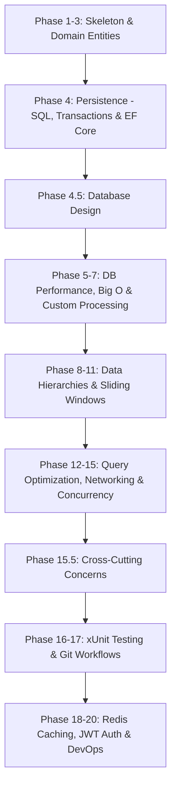

# CSBank: Practical Learning Path (Database-First)

This roadmap is optimized for a **Database-First, Enterprise-Ready** backend developer. You will build **CSBank**, a modular banking system where registration acts as the foundational first use-case. Rather than writing temporary in-memory mock repositories, you will work against a database from day one.

---

## 🗺️ SQL vs. EF Core: Which Do You Learn?

In a professional C# backend role, you do not choose between SQL and EF Core. **You must understand both, but they serve different purposes:**

| Tool | What It Is | Practical Role in Your Job |
| :--- | :--- | :--- |
| **SQL** | The universal database language. | Used to design tables, write indexes, analyze query execution plans, and write high-performance raw queries (e.g., using Dapper) when ORMs are too slow. |
| **EF Core** | An Object-Relational Mapper (ORM). | The primary framework you write daily in C#. It translates your C# LINQ queries into SQL automatically, speed-running CRUD development. |

---

## 📈 Database-First Roadmap

---

### 📦 Phase 1 to 3: Core OOP & Domain Entities
*Already completed in your workspace skeleton.*
*   **Concepts:** Clean-architecture project separation (`Api`, `Application`, `Domain`, `Infrastructure`).
*   **Project Application:** 
    *   Explicitly separate model boundaries:
        *   **DTOs:** Data holders for API requests/responses (e.g., `CustomerDto`).
        *   **Domain Entities:** Pure business logic and rules (e.g., `Customer` entity in Domain), free from database annotations.
        *   **Persistence Models:** Models mapping to database tables (if decoupling domain from EF configurations).

---

### 💾 Phase 4: Persistence (SQL, PostgreSQL & EF Core)
*Instead of writing temporary memory lists, you write to a database from day one.*
*   **Concepts:** Database tables, ORM configuration, data persistence, **Transactions (ACID & Rollbacks)**, and **Projections (`.Select()`)**.
*   **Project Application:** 
    *   Install Entity Framework Core and Npgsql in the `Infrastructure` layer.
    *   Implement an `ICustomerRepository` that saves registrations to PostgreSQL.
    *   Handle saving both `Customer` and `PrivateInfo` records inside a single transaction to learn atomicity and rollback mechanics.
    *   Write basic read queries using `.Select()` projections to fetch only required columns.

---

### 🗄️ Phase 4.5: Relational Database Design
*Learn database principles that are independent of any ORM framework.*
*   **Concepts:** Primary Keys, Foreign Keys, Unique Constraints, Check Constraints, Normalization (1NF, 2NF, 3NF), and Relationship Cardinality (One-to-One, One-to-Many, Many-to-Many).
*   **Project Application:** Apply constraints and normalization rules to the database schema (e.g., establishing a 1:1 relationship between `Customer` and `PrivateInfo` tables using keys and foreign key constraints).

---

### 🚀 Phase 5 to 7: DB Benchmarks, Big O & Memory Processing
*Query data from your database and process it in memory to learn algorithms and performance trade-offs.*
*   **Phase 5 — Big O & DB Indexes:** Seed 100,000 registrations. Benchmark query lookup speeds using a non-indexed column vs. an indexed column (understanding how index B-Trees achieve $O(\log n)$ lookup times compared to $O(n)$ table scans).
*   **Phase 6 — Searching:** Fetch a dataset of registered users from the database, and write a custom **Binary Search** in C# to find a user by birthdate in memory (requires sorting first).
*   **Phase 7 — Sorting:** Retrieve a raw list of customer registrations from the database and write a custom **QuickSort** in your application service to sort them by registration date before exporting them.

---

### 🌿 Phase 8 to 11: Hierarchies, Graphs & Security Patterns
*Use database data to build advanced business logic flows.*
*   **Phase 8 — Trees (Hierarchies):** Create a database table mapping the bank's branches (Head Office $\rightarrow$ Regional Offices $\rightarrow$ Local Branches). Write recursive C# code to traverse this branch tree.
*   **Phase 9 — Graphs:** Map physical transfer routes between branches. Implement a pathfinding algorithm in your Domain layer to calculate the shortest path to route customer records between branches.
*   **Phase 10 — Algorithmic Techniques (Rate Limiting):** Write a sliding-window rate limiter in your middleware to block client IPs that send duplicate registrations in a short window.
*   **Phase 11 — Mathematics:** Calculate credit scores dynamically during registration using modular logic, and write robust date-of-birth validation formulas.

---

### ⚡ Phase 12 to 15: Optimization, Networking & Concurrency
*Make your database-driven application secure, fast, and safe under heavy multi-user load.*
*   **Phase 12 — Query Optimization & SQL Generation:** Optimize database reads. Focus on identifying and resolving the N+1 select problem, reading query execution plans, implementing compiled queries, and utilizing correct database loading strategies (e.g. eager, lazy, explicit).
*   **Phase 13 — Operating Systems (Non-Blocking I/O):** Write registration audit logs to disk asynchronously using non-blocking OS file streams.
*   **Phase 14 — Computer Networking (REST Principles):** Expose registration as an HTTP REST endpoint. Learn HTTP verbs, Status codes, Idempotency, REST principles, CORS, HTTPS, and JSON serialization.
*   **Phase 15 — Concurrency & DB Locks:** Use unique constraints in PostgreSQL. Write exception handlers to catch constraint failures (e.g., Postgres `23505` duplicate key) to handle simultaneous duplicate registrations gracefully without server crashes.

---

### 🛠️ Phase 15.5: Cross-Cutting Concerns
*Standardize the core foundations used across every ASP.NET Core production backend.*
*   **Concepts:** Structured Logging (Serilog/Console), Configuration management (Options Pattern), Global Exception Handling Middleware, ProblemDetails standard formatting, and Health Checks.
*   **Project Application:** Implement middleware to capture all registration exceptions and map them to standard ProblemDetails JSON output. Set up health endpoints (`/healthz`) to verify database connectivity.

---

### 🛡️ Phase 16 to 17: Testing & Git Workflows
*Enforce clean-code practices, verification, and collaboration strategies.*
*   **Phase 16 — Software Engineering (Testing):** Write unit tests with **xUnit** and **NSubstitute** to verify business and validation rules in your service layer.
*   **Phase 17 — Version Control:** Manage branching workflows and resolve merge conflicts in controllers.

---

### 🚀 Phase 18 to 20: Caching, Security & DevOps
*Scale your verified application for cloud deployment.*
*   **Phase 18 — System Design (Caching):** Set up a **Redis Cache** in your Infrastructure layer to store active customer profiles, bypassing PostgreSQL queries for hot reads.
*   **Phase 19 — Security & Frameworks:** Define an `IPasswordHasher` interface in the Application layer, and implement it using BCrypt in the Infrastructure layer. Authenticate read endpoints using JWT.
*   **Phase 20 — DevOps & Deploy:** Write a `Dockerfile`, set up CI/CD workflows, and deploy your API.
