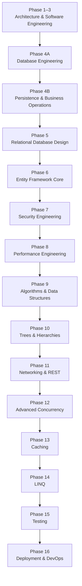

# Path.md

# CSBank Learning Path

This roadmap is designed to build **CSBank** while learning backend engineering from first principles.

Each phase introduces new concepts only after the previous foundation has been understood, ensuring every abstraction is learned through implementation rather than memorization.

The objective is not simply to build a banking system, but to understand **why each engineering concept exists** before relying on higher-level frameworks.

---

# Learning Philosophy

CSBank follows one fundamental principle:

> **Understand the abstraction before using the abstraction.**

Every technology introduced in this roadmap should explain a concept that has already been implemented manually.

Learning progresses from concepts to abstractions:

```text
Programming

↓

Object-Oriented Programming

↓

Software Engineering

↓

Database Engineering

↓

Persistence Engineering

↓

Business Operations Engineering

↓

Relational Database Design

↓

Entity Framework Core

↓

Security Engineering

↓

Performance Engineering

↓

Production Engineering
```

Frameworks should increase productivity—not replace understanding.

---

# Current Progress

| Phase | Status |
|--------|--------|
| Phase 1–3 — Clean Architecture & Software Engineering | ✅ Complete |
| Phase 4A — PostgreSQL & Database Engineering | ✅ Complete |
| Phase 4B — Persistence & Business Operations Engineering | ✅ Complete |
| Phase 5 — Relational Database Design | ✅ Complete |
| Phase 6 — Entity Framework Core | ✅ Complete |
| Phase 7 — Security Engineering | 🚧 Current |

Current milestone:

The architectural foundation is now complete.

CSBank now follows a hybrid persistence architecture:

- Writes → Entity Framework Core
- Reads → Dapper

Major business functionality has been completed, including:

- Customer Registration
- Customer Profile
- Customer Update
- Account Creation
- Deposit
- Transfer
- Transaction History with OFFSET pagination

Current work focuses on preparing the application for production by implementing authentication, authorization, endpoint protection, and secure persistence.

---

# Learning Roadmap


```mermaid
graph TD

A[Phase 1–3<br/>Architecture & Software Engineering]

--> B[Phase 4A<br/>Database Engineering]

--> C[Phase 4B<br/>Persistence & Business Operations]

--> D[Phase 5<br/>Relational Database Design]

--> E[Phase 6<br/>Entity Framework Core]

--> F[Phase 7<br/>Security Engineering]

--> G[Phase 8<br/>Performance Engineering]

--> H[Phase 9<br/>Algorithms & Data Structures]

--> I[Phase 10<br/>Trees & Hierarchies]

--> J[Phase 11<br/>Networking & REST]

--> K[Phase 12<br/>Advanced Concurrency]

--> L[Phase 13<br/>Caching]

--> M[Phase 14<br/>LINQ]

--> N[Phase 15<br/>Testing]

--> O[Phase 16<br/>Deployment & DevOps]
```

---

# Phase 1–3 — Clean Architecture & Software Engineering ✅

Purpose:

Understand how enterprise applications separate responsibilities before introducing persistence.

Concepts learned:

- Clean Architecture
- Solution organization
- Domain Models
- Domain Services
- Business Rules
- DTOs
- Manual Mapping
- Repository Abstractions
- Dependency Injection
- Application Services
- Customer Registration

Major outcome:

Built a complete backend architecture independent of any persistence technology.

---

# Phase 4A — PostgreSQL & Database Engineering ✅

Purpose:

Understand how relational databases store, protect and retrieve data before introducing persistence libraries.

Concepts learned:

## Database Fundamentals

- CREATE DATABASE
- Schemas
- Tables
- Data Types

## CRUD

- INSERT
- SELECT
- UPDATE
- DELETE
- RETURNING
- Writable CTEs

## Relationships

- Primary Keys
- Foreign Keys
- One-to-One
- One-to-Many

## Transactions

- BEGIN
- COMMIT
- ROLLBACK
- Statement-level atomicity
- Transaction-level atomicity

## Constraints

- UNIQUE
- CHECK
- Referential Integrity
- Cascade behaviors

## Query Design

- JOINs
- Aggregation
- GROUP BY
- COUNT
- EXISTS
- LIMIT
- OFFSET
- Explicit column selection

## ORM Mental Model

Understand:

- PostgreSQL stores relational data.
- SQL reconstructs relationships.
- Dapper executes SQL directly.
- EF Core builds abstractions over SQL.

Major outcome:

Transitioned from isolated SQL statements to complete relational workflows.

---

# Phase 4B — Persistence & Business Operations Engineering ✅

Purpose:

Understand how enterprise applications execute business operations safely, atomically, and efficiently.

Technologies:

- PostgreSQL
- Npgsql
- Dapper

Infrastructure concepts:

- Connection Factory
- Repository Pattern
- Repository Executor
- Higher-Order Functions
- Dependency Injection
- Transaction abstraction
- SQL organization

Language concepts:

- Delegates
- Func<>
- Lambda Expressions
- Higher-Order Functions

Persistence concepts:

- Transaction management
- Repository orchestration
- Common Table Expressions (CTEs)
- Row-level locking (`FOR UPDATE`)
- Atomic SQL workflows
- Parameterized SQL
- Race condition prevention
- Exception propagation

Business concepts:

- Customer Registration
- Account Creation
- Deposit
- Transfer
- Ledger Architecture
- Transaction History
- Audit Logging
- Balance Consistency
- Business Workflow Modeling

Completed operations:

- Customer Registration ✅
- Customer Profile ✅
- Update Customer ✅
- Create Account ✅
- Deposit ✅
- Transfer ✅
- Transaction History (OFFSET Pagination) ✅

Major outcome:

Built reusable persistence infrastructure capable of executing complete banking workflows while validating concurrency, ledger consistency, and transactional correctness.

---

# Phase 5 — Relational Database Design ✅

Purpose:

Understand how enterprise databases evolve beyond CRUD.

Topics learned:

- One-to-One
- One-to-Many
- Many-to-Many
- Composite Keys
- Candidate Keys
- Alternate Keys
- Normalization (1NF–3NF)
- Denormalization
- Constraint Design
- Index Strategy
- Schema Evolution
- ERD Refinement

Major outcome:

Developed the ability to model and evolve relational databases according to business requirements, justify relationships and constraints, and confidently modify schemas as the domain evolves.

---

# Phase 6 — Entity Framework Core ✅

Purpose:

Understand Entity Framework Core as an abstraction built upon concepts already mastered manually.

Technologies:

- Entity Framework Core
- PostgreSQL
- Npgsql

Topics completed:

## Core Components

- DbContext
- DbSet
- Entity States
- Change Tracker

## Mapping

- Fluent API
- Entity Configuration
- Navigation Properties
- Relationship Mapping
- PostgreSQL Enum Mapping

## Querying

- Generated SQL Inspection
- Tracking vs AsNoTracking
- Loading Strategies
- SQL Comparison with Dapper

## Persistence

- Repository Integration
- Update Aggregate
- SaveChanges Pipeline

## Engineering

- EF Core vs Dapper
- Unit of Work
- Change Tracking
- Performance Trade-offs

Conceptually understood:

- Migrations
- Value Converters
- Owned Types

Major outcome:

Successfully integrated EF Core into the project while preserving the project's persistence philosophy.

The application now intentionally uses:

- Writes → Entity Framework Core
- Reads → Dapper

---

# Phase 7 — Security Engineering 🚧

Purpose:

Prepare CSBank for production by protecting user identities, financial operations, and sensitive information.

Topics:

## Authentication

- Identity
- Login
- Stateless Authentication
- Sessions vs JWT

## Password Security

- BCrypt
- Salt
- Work Factor
- Password Verification

## JWT

- Claims
- Signature
- Expiration
- Token Validation

## Authorization

- Roles
- Policies
- Claims
- Resource Ownership

## API Security

- Protected Endpoints
- Ownership Validation
- Input Validation
- SQL Injection Prevention

## Secret Management

- Environment Variables
- Secret Storage
- Configuration

## HTTPS

- TLS
- Certificates
- Secure Communication

Major objective:

Build secure authentication and authorization while maintaining Clean Architecture and hybrid persistence.

---

# Phase 8 — Performance Engineering

Purpose:

Understand how engineering decisions affect scalability and responsiveness.

Topics:

## PostgreSQL

- EXPLAIN
- EXPLAIN ANALYZE
- Execution Plans
- Sequential Scan vs Index Scan
- Composite Indexes
- Covering Indexes
- Query Optimization
- EXISTS vs JOIN
- LIMIT / OFFSET
- Cursor Pagination
- Window Functions

## Dapper

- QueryMultiple
- Multi Mapping
- Buffered vs Streaming
- Allocation Reduction

## EF Core

- Generated SQL
- Compiled Queries
- Split Queries
- N+1 Detection
- Change Tracker Cost
- AsNoTracking Performance

## .NET

- Collections
- LINQ Performance
- Span<T>
- Memory Allocation
- ValueTask
- BenchmarkDotNet

Major objective:

Optimize only after measuring.

---

# Phase 9 — Algorithms & Data Structures

Topics:

- Searching
- Sorting
- Hash Tables
- Queues
- Stacks
- Graph Basics

Purpose:

Apply algorithms where they improve backend systems.

---

# Phase 10 — Trees & Hierarchies

Topics:

- Recursive Traversal
- Trees
- Parent-child Relationships
- Recursive SQL

Purpose:

Model hierarchical business data.

---

# Phase 11 — Networking & REST

Topics:

- HTTP
- HTTPS
- REST
- Status Codes
- API Design
- CORS
- Idempotency

Purpose:

Understand communication between distributed systems.

---

# Phase 12 — Advanced Concurrency

Topics:

- Isolation Levels
- Optimistic Concurrency
- Pessimistic Locking
- Deadlocks
- Retry Strategies
- Concurrent Updates

Purpose:

Design systems that remain correct under concurrent workloads.

---

# Phase 13 — Caching

Topics:

- IMemoryCache
- Redis
- Distributed Cache
- Cache Aside
- Cache Invalidation

Purpose:

Improve performance while maintaining consistency.

---

# Phase 14 — LINQ

Purpose:

Master LINQ as a language feature before relying on it throughout enterprise applications.

Topics:

- IEnumerable
- IQueryable
- Deferred Execution
- Projection
- Filtering
- Ordering
- Grouping
- Aggregation
- Set Operations

Major outcome:

Understand LINQ rather than memorizing extension methods.

---

# Phase 15 — Testing

Purpose:

Verify business correctness and prevent regressions.

Technologies:

- xUnit
- NSubstitute

Topics:

- Unit Testing
- Integration Testing
- API Testing
- Repository Testing
- Concurrency Testing

---

# Phase 16 — Deployment & DevOps

Topics:

- Docker
- Docker Compose
- CI/CD
- Environment Configuration
- Cloud Deployment
- Logging
- Monitoring

Purpose:

Operate backend systems reliably in production.

---

# End Goal

Build a production-quality banking backend while understanding every abstraction throughout the backend stack.

By completing CSBank, you should understand:

- Clean Architecture
- Software Engineering
- PostgreSQL
- Database Engineering
- Dapper
- Entity Framework Core
- Hybrid Persistence Architecture
- Security Engineering
- Performance Engineering
- Algorithms & Data Structures
- Networking
- Advanced Concurrency
- Caching
- LINQ
- Testing
- Deployment

Every phase intentionally builds upon the previous one so that each abstraction reinforces concepts already understood instead of replacing them.

The objective is not simply to complete CSBank, but to develop the engineering mindset required to design, build, and maintain production-quality backend systems.