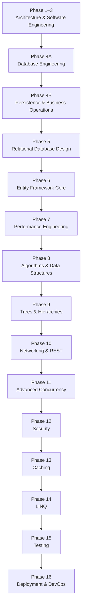

# Path.md

# CSBank Learning Path

This roadmap is designed to build **CSBank** while learning backend engineering from first principles.

Each phase introduces new concepts only after the previous foundation has been understood, ensuring every abstraction is learned through implementation rather than memorization.

The objective is not simply to build a banking system, but to understand **why each engineering concept exists** before relying on higher-level frameworks.

---

# Learning Philosophy

CSBank follows one fundamental principle:

> **Understand the abstraction before using the abstraction.**

Every technology introduced in this roadmap should explain a concept that has already been implemented manually.

Learning progresses from concepts to abstractions:

```text
Programming

↓

Object-Oriented Programming

↓

Software Engineering

↓

Database Engineering

↓

Persistence Engineering

↓

Business Operations Engineering

↓

Relational Database Design

↓

Entity Framework Core

↓

Performance Engineering

↓

Production Engineering
```

Frameworks should increase productivity—not replace understanding.

---

# Current Progress

| Phase | Status |
|--------|--------|
| Phase 1–3 — Clean Architecture & Software Engineering | ✅ Complete |
| Phase 4A — PostgreSQL & Database Engineering | ✅ Complete |
| Phase 4B — Persistence & Business Operations Engineering | 🚧 Current |
| Phase 5 — Relational Database Design | ⏳ Planned |
| Phase 6 — Entity Framework Core | ⏳ Planned |

Current milestone:

The architectural foundation is complete.

Current work focuses on engineering transaction-safe banking operations using PostgreSQL, Dapper and reusable persistence infrastructure.

The emphasis has shifted from building architecture to designing complete business workflows.

---

# Learning Roadmap


```mermaid
graph TD

A[Phase 1–3<br/>Architecture & Software Engineering]

--> B[Phase 4A<br/>Database Engineering]

--> C[Phase 4B<br/>Persistence & Business Operations]

--> D[Phase 5<br/>Relational Database Design]

--> E[Phase 6<br/>Entity Framework Core]

--> F[Phase 7<br/>Performance Engineering]

--> G[Phase 8<br/>Algorithms & Data Structures]

--> H[Phase 9<br/>Trees & Hierarchies]

--> I[Phase 10<br/>Networking & REST]

--> J[Phase 11<br/>Advanced Concurrency]

--> K[Phase 12<br/>Security]

--> L[Phase 13<br/>Caching]

--> M[Phase 14<br/>LINQ]

--> N[Phase 15<br/>Testing]

--> O[Phase 16<br/>Deployment & DevOps]
```

---

# Phase 1–3 — Clean Architecture & Software Engineering ✅

Purpose:

Understand how enterprise applications separate responsibilities before introducing persistence.

Concepts learned:

- Clean Architecture
- Solution organization
- Domain Models
- Domain Services
- Business Rules
- DTOs
- Manual Mapping
- Repository Abstractions
- Dependency Injection
- Application Services
- Customer Registration

Major outcome:

Built a complete backend architecture independent of any persistence technology.

---

# Phase 4A — PostgreSQL & Database Engineering ✅

Purpose:

Understand how relational databases store, protect and retrieve data before introducing persistence libraries.

Concepts learned:

## Database Fundamentals

- CREATE DATABASE
- Schemas
- Tables
- Data Types

## CRUD

- INSERT
- SELECT
- UPDATE
- DELETE
- RETURNING
- Writable CTEs

## Relationships

- Primary Keys
- Foreign Keys
- One-to-One
- One-to-Many

## Transactions

- BEGIN
- COMMIT
- ROLLBACK
- Statement-level atomicity
- Transaction-level atomicity

## Constraints

- UNIQUE
- CHECK
- Referential Integrity
- Cascade behaviors

## Query Design

- JOINs
- Aggregation
- GROUP BY
- COUNT
- Explicit column selection

## ORM Mental Model

Understand:

- PostgreSQL stores relational data.
- SQL reconstructs relationships.
- Dapper executes SQL directly.
- EF Core abstracts persistence.

Major outcome:

Transitioned from isolated SQL statements to complete relational workflows.

---

# Phase 4B — Persistence & Business Operations Engineering 🚧

Purpose:

Understand how enterprise applications execute business operations safely, atomically and efficiently.

Technologies:

- PostgreSQL
- Npgsql
- Dapper

Infrastructure concepts:

- Connection Factory
- Repository Pattern
- Repository Executor
- Higher-Order Functions
- Dependency Injection
- Transaction abstraction
- SQL organization

Language concepts:

- Delegates
- Func<>
- Lambda Expressions
- Higher-Order Functions

Persistence concepts:

- Transaction management
- Repository orchestration
- Common Table Expressions (CTEs)
- Row-level locking (`FOR UPDATE`)
- Atomic SQL workflows
- Parameterized SQL
- Race condition prevention
- Exception propagation

Business concepts:

- Customer registration
- Account creation
- Checking accounts
- Savings accounts
- Ledger architecture
- Transaction history
- Audit logging
- Balance consistency
- Business workflow modeling

Current completed operations:

- Customer Registration ✅
- Customer Profile ✅
- Create Account ✅
- Create Checking Account ✅
- Create Savings Account ✅
- Deposit (with transaction history and audit logging) ✅

Current work:

- Withdraw
- Transfer
- Additional business operations

Major outcome:

Transitioned from CRUD repositories to reusable persistence infrastructure capable of executing complete banking workflows.

---

# Phase 5 — Relational Database Design

Purpose:

Learn how enterprise databases evolve beyond CRUD.

Topics:

- One-to-One
- One-to-Many
- Many-to-Many
- Composite Keys
- Candidate Keys
- Alternate Keys
- Normalization (1NF–3NF)
- Denormalization
- Constraint Design
- Index Strategy
- Schema Evolution
- ERD Refinement

Major outcome:

Understand how database design supports long-term maintainability before introducing ORM mapping.

---

# Phase 6 — Entity Framework Core

Purpose:

Learn EF Core as an abstraction built upon concepts already understood.

Topics:

- DbContext
- DbSet
- Fluent API
- Entity Configuration
- Change Tracking
- Relationship Mapping
- Value Conversions
- Loading Strategies
- Migrations

Major outcome:

Understand exactly what EF Core is abstracting rather than treating it as a black box.

---

# Phase 7 — Performance Engineering

Topics:

Database

- Query Optimization
- Query Plans
- EXPLAIN ANALYZE
- Index Strategy

Application

- Big-O Analysis
- Collection Performance
- Memory Usage

Goal:

Understand how engineering decisions affect scalability.

---

# Phase 8 — Algorithms & Data Structures

Topics:

- Binary Search
- Merge Sort
- Quick Sort
- Hash-based Lookups
- Efficient Collection Processing

Purpose:

Apply algorithms where they improve backend systems.

---

# Phase 9 — Trees & Hierarchies

Topics:

- Recursive Traversal
- Tree Structures
- Parent-child Relationships
- Recursive SQL

Purpose:

Model hierarchical business data.

---

# Phase 10 — Networking & REST

Topics:

- HTTP
- HTTPS
- REST
- Status Codes
- CORS
- API Design
- Idempotency

Purpose:

Understand communication between distributed systems.

---

# Phase 11 — Advanced Concurrency

Topics:

- Transaction Isolation
- Optimistic Concurrency
- Pessimistic Locking
- Deadlocks
- Retry Strategies
- Concurrent Updates

Purpose:

Design systems that remain correct under concurrent requests.

---

# Phase 12 — Security

Topics:

- BCrypt
- JWT Authentication
- Authorization
- Input Validation
- SQL Injection Prevention
- Secure DTO Projection

Purpose:

Protect business operations and sensitive data.

---

# Phase 13 — Caching

Topics:

- IMemoryCache
- Redis
- Distributed Cache
- Cache-aside Pattern
- Cache Invalidation

Purpose:

Improve application performance while maintaining consistency.

---

# Phase 14 — LINQ

Purpose:

Master LINQ as a C# language feature before relying on it in testing and EF Core.

Topics:

- IEnumerable
- IQueryable
- Deferred execution
- Projection
- Filtering
- Ordering
- Grouping
- Aggregation
- Set operations

Major outcome:

Understand LINQ as language-integrated querying rather than simply memorizing extension methods.

---

# Phase 15 — Testing

Purpose:

Learn software testing rather than merely learning xUnit.

Technologies:

- xUnit
- NSubstitute

Topics:

- Testing fundamentals
- Arrange → Act → Assert
- Domain testing
- Infrastructure testing
- Integration testing
- API testing
- Concurrency testing

Major outcome:

Verify business correctness and prevent regressions while strengthening backend engineering knowledge.

---

# Phase 16 — Deployment & DevOps

Topics:

- Docker
- Docker Compose
- CI/CD
- Environment Configuration
- Cloud Deployment
- Logging
- Monitoring
- Configuration Management

Purpose:

Operate backend systems reliably in production.

---

# End Goal

Build a production-quality banking backend while understanding every abstraction throughout the backend stack.

By completing CSBank, you should understand:

- Clean Architecture
- Software Engineering
- PostgreSQL
- Database Engineering
- Dapper
- Persistence Engineering
- Business Operations Engineering
- Relational Database Design
- Entity Framework Core
- Performance Engineering
- Algorithms & Data Structures
- Networking
- Concurrency
- Security
- Caching
- LINQ
- Testing
- Deployment

Every phase intentionally builds upon the previous one so that each new abstraction reinforces concepts already understood instead of replacing them.

The objective is not simply to complete CSBank, but to develop the engineering mindset required to design, build and maintain production-quality backend systems.